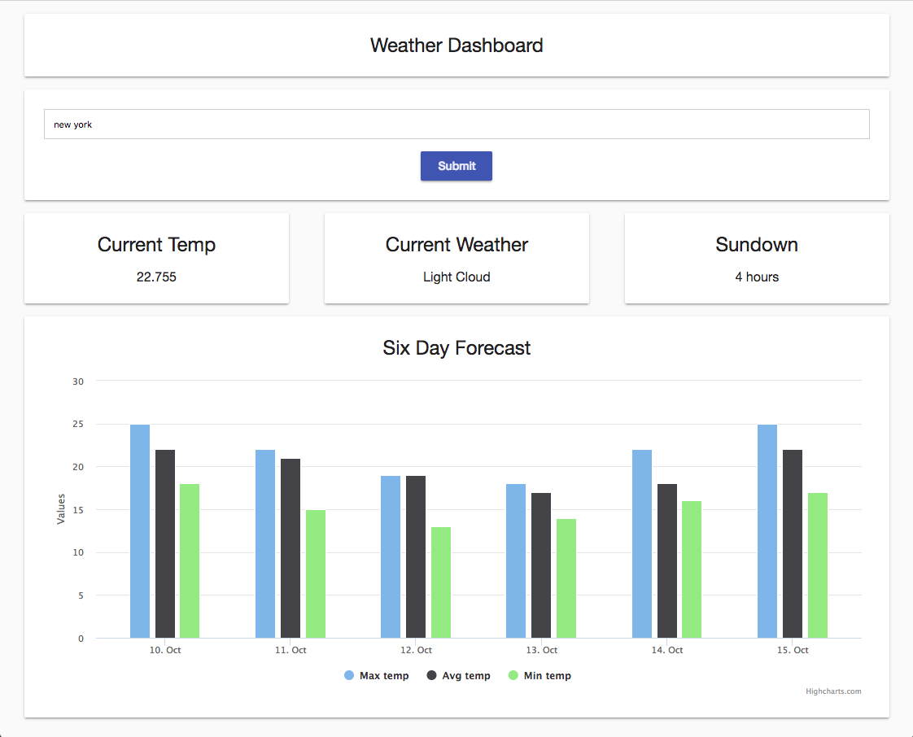

# Weather Forecast App
This challenge was set by Toumetis on the 12th April for completion by the 19th April.

## The Brief
A client requires a simple web application that will enable their analysts to understand the weather in a specific location in the world 🌎. 
Your brief is to create a single page web application that will allow the user to enter a location and view weather details about it. The client would like to see the following details in particular:

- Current temperature
- Current weather conditions
- Time till next sunset
- Chart showing the forecast (min, max and average temperature) for the next six days including today.

Extra tasks:
The client would also like to see the current search location pinned on a map.
Implement an autocomplete widget for the location search - a basic implementation is all that is required. If you were to develop a full production implementation:
- What would the inputs/outputs look like?
- What performance considerations are there?
- What edge cases could there be?
- How would you decouple this widget from this particular use case?

## Setup Prerequisites
Installation of yarn on local machine

## Setup Install
cd to local desired folder

git clone git@github.com:vbro1293/weather-forecast-app.git

yarn install (This should run the package.json file and install all the relevant devpendencies to get the app running locally)

## Run app
yarn start (View on localhost:3000)

(yarn watch-css -Starts watching on sass files, if editing)

# The Project
Initially being given a clear defined brief and wireframe, I set out the following stages to the project in order to manage the project efficiently.

- Functional specification
- Technology choice
- Logic
- Setup/Documentation/Git
- File system planning
- MVP
- Testing

The following was the wireframe provided.

## Functional Specification
From the brief and wireframe, the app has a very clearly defined specification for the MVP

1. Show the current temperature
2. Show the current weather conditions
3. Show the time till next sunset
4. Show a chart showing the forecast (min, max and average temperature) for the next six days including today.

Extra Features
1. Show current location on a map
2. Autocomplete widget for location search

## Technology Choice
I chose to use React and Redux for this project and use axios to make requests to the API. It is a technology that I am still learning but enjoy using it and thought it was appropriate for the app, as it focuses on interactive UIs.

## Logic
This is a very high-level overview of the logic that I thought my MVP should have. It helped gain a better understanding of the steps for creating the app.
1. User inputs location name
2. "submit" button, takes inputtted location name
3. Uses location name in the request to API
4. API response contains location id
5. Use returned location id to make request to API
6. API response contains weather data
7. Store data locally
8. Display weather data

## Setup/Documentation/Git
1. Setup github repo page
2. Setup local folder to store app
3. create-react-app weather-forecast-app
4. git init, git remote add origin …, git add *, git commit -m “initial commit”, git push origin master
5. Create development branch to keep inline with GitFlow workflow
6. Created feature branches in order to commit work to and used pull requests, code reviews to merge branches into development. Create versions to release work onto master.
7. To startup app - yarn start, app runs on localhost:3000
8. Use yarn as the dependency manager
9. Additional libraries added using "yarn add [library]" : 
    - immutable (create immutable Map and List)
    - redux (state kept in store, data can be passed as props and dispatches can be passed as props in order to update the state)
    - react-redux (connect react and redux)
    - redux-thunk (allows useage of middleware- Redux DevTools for debugging during development)
    - node-sass-chokidar (used react documentation to enable the css preprocessor Sass, run "yarn watch-css")
    - axios (allows browser to make http requests)
    - react-jsx-highcharts (create component based highcharts)

## File system planning
This is a rough plan of the file system which I try to follow, in order to have clear places to stores specific parts of the app. This helped when having to find these files again and knowing where the best place to save them was, setting this up initially helps with ensuring nothing is forgotten.

In the app/src folder:

components/ [contains just the ui, minimal logic, no hard data - just passed in data]

containers/ [contains wrapped components, enabling dispatching]

data/ [all the data - actions(api and state), initial, reducer, store]

media/ [image for background]

styles/ [all the styling files]

styles/scss [contains sass files]

styles/css [contains css files created from scss]

app.css [contains import of css file which was created priginally from sass files]

index.css [contains css of the general page styling - minimal]

index.js [contains the wrapped App.js with Provider (connecting components with store) and Router (allows routing withing app)]

## MVP
From experience with my previous similar project, pre-planning and ongoing planning throughout the project was very useful - it limited the decisions that needed to be made whilst creating it.
I used GoogleDocs to pre-plan the feature branches and how I would go about implementing features. The following give more detail about creating the app.

### Work flow/Work Process
I chose to use Gitflow in order to do my work. Working with a master branch, development branch and feature branches. The master was only merged into a limited amout of times. The development was the primary branch of focus as feature branches were created off of it in order to do specific pieces of work. I generally committed multiple times on the branch in order to track of my work with commenting the commits. I then created pull requests for them and merged them back into development. This allowed a controlled and smooth work flow. After a significant number of feature branches, I merged development into master and tagged each version.

### API
I used axios as the library to integrate the API. It allows the app to send a GET method to the API using the location inputted by the user, a promise is then added for asynchronous behaviour, so that another GET is dispatched to the API using the woeid id returned from the first fetch. This will then have another promise to return the forecast information object. If either fail to return data an error is dispatched to store.

The API to use was given in the brief - http://interview.toumetisanalytics.com/location/london for fetching location id using the inputted location and http://interview.toumetisanalytics.com/weather/2459115 for fetching the forecast information using the woeid ID.

### Styling - SASS and Mobile First
I styled this with a mobile-first approach and using Sass as the CSS pre-processor.

I chose Sass as it allows easy implentation of variables, prevents repitition and it is good for organising styling. 

The mobile-first approach was done by creating a base style sheet and then adding additional style sheets for increasing screen-sizes. I have found that this is a good way to ensure an app is responsive.

### Autocomplete Feature (Extra task)
I added a basic autocomplete feature to the app. I stored an array of cities in the store, passed them down as props to the form component and compared the input to the locations, rendering a list of matches. On click of the location list item, the input field was populated. This was obviously a simplified version to a full production version of the app, as the cities were limited and manually added, which would not be practical if including every possible city in the world.

For full production implementation, I would use some API to fetch matches to the inputted data. Performance-wise this could be fairly slow, as it would have to go through a lot of data, dispatch it to the component and render it out and repeated everytime the user changes the input. This could be more efficient by limiting the number of requests. By considering an "average" user of this app, they would only a few locations reguarly, so caching these locations could be an option. To decouple from my app, the input/form  components could be taken out of the app and the only thing changing would be the list of locations (manual or from API), so it could be inserted into another app and the source of the list of cities could be replaced with any other.

### Testing
I completed manual testing throughout the project to hopefully minimise obvious functional bugs e.g. space inputting and button disabling, non alpha characters.
Being just a one page app with basic useage, hopefully useability is not too difficult, but useability testing would be required if the app was to extend to multiple pages with the potential for more forecast data.

If the app was to go into further development, testing for readability and WAVE accessibility would be important, but for the purpose of a technicial challenge I did not carry this through.

I tested this on Chrome and Firefox but further cross-browser testing would be beneficial. I also only tested on mobile using Chrome DevTools, but testing on multiple mobile devices should also be considered.

Performance/Speed testing would also be considered with extension of the app, especially with added features such as maps and autocomplete.

# Evaluation
 - With more time it would be good to include a map with a pin reference to location, or some kind of weather map. This would have been a good implentation with more time, which would involve adding an extra library with an API to google maps. Implementing auto complete using the API would have been good too.

 - Initially I had some difficulty with the API- I was unsure about carrying out nested API requests- using the data from the first response directly into the second. I had only used axios a few times prior so I read some more documentation, research and experimented with it and eventually to get it to work. 

 - Using the data from the API - I ended up with some averages which were higher than the max temperature. So I am unsure if I was using the incorrect average temperature.

 - I added the same promise to both API requests, however the error would be different and the second would be a server-side error, as if it has successfully retrieved the location, then any error of the second request cannot be of fault of the client as the woeid id is used directly to make the second request. This could be handled better with more time and much more important if it went into production.

 - I started by storing the whole weather object in global state, and carrying out the logic to get the required data in the components. I then moved that into reducer and only stored relevant data. This was probably not the preferred way to do it, as it wasted time refactoring it. I initially did this as I was unsure of the best way to do it and wanted to be able to make progress in rendering the data, but by following best practice to seperate the logic and components I refactored it.

 - Overall, I think that I achieved a MVP that matches the brief. This was good practice to increase my knowledge and understanding of APIs and implementing axios into React Redux, so next time I would hopefully be able to achieve this in a more efficient manner.